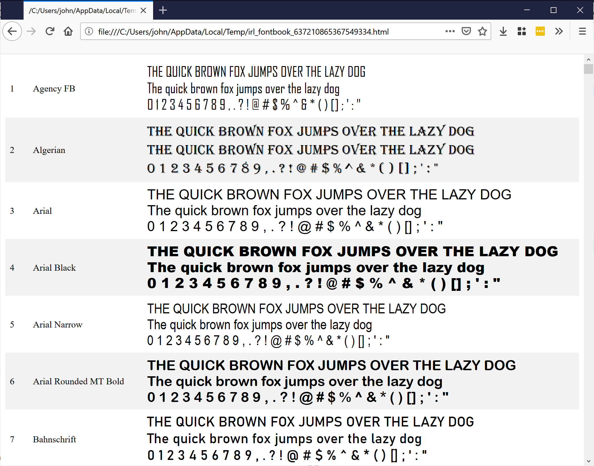

# IRL Fontbook

Html generator for printable fontbooks



## Usage

```
git clone https://github.com/jogleasonjr/irl_fontbook.git
cd irl_fontbook
dotnet run
```

The program will output the path to an HTML file in the user's temp directory.